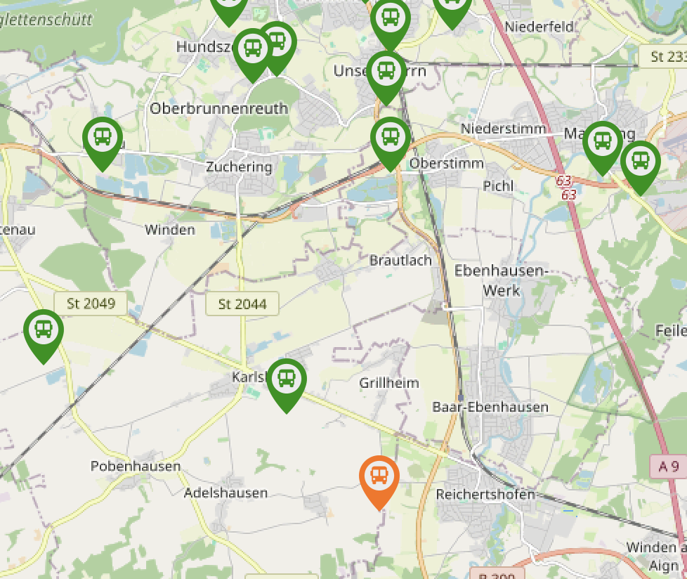
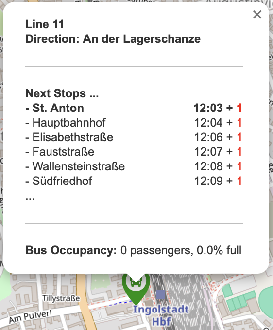
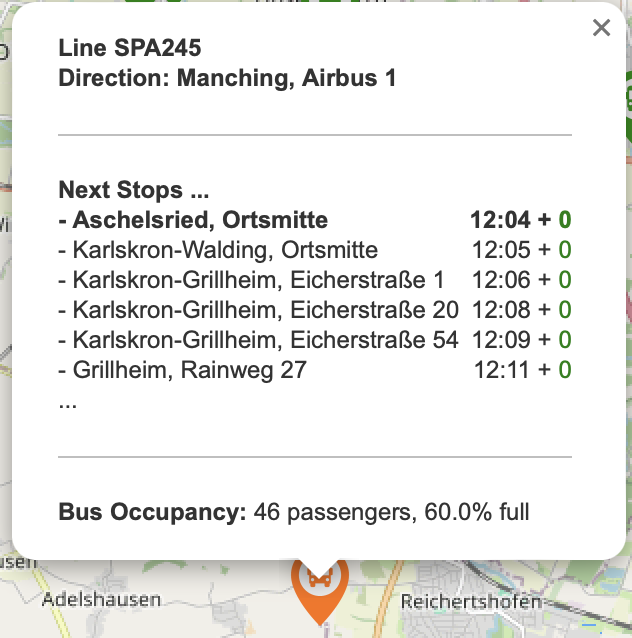
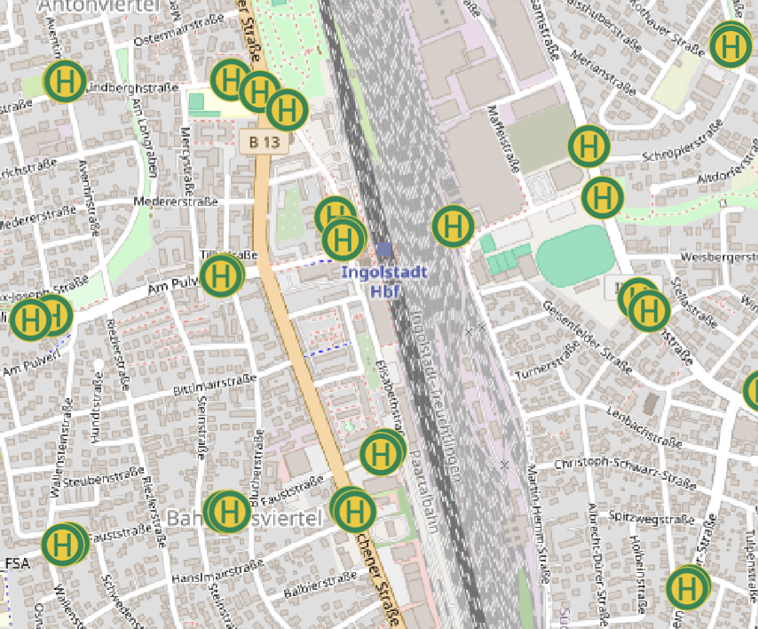
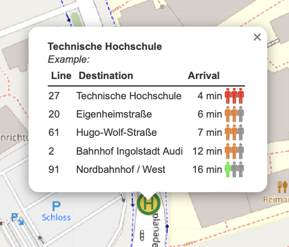

# VGI Challenge: Real-Time Bus Visualization on a Map

## Objectives
The objective of this challenge is to create an interactive map that visualizes real-time bus locations using the SIRI-VM interface. 
The interface is designed to allow the upload of XML files by transport providers, such as Verkehrsverbund Großraum Ingolstadt (VGI), to display geodata of buses in real time. 

The map will feature dynamic "pop-ups" that show essential information, including upcoming bus stops, real-time occupancy, and other relevant details for each stop. 
This setup aims to provide a live view of bus movements and passenger load, enhancing the public transit experience for users.

### Description
| Live Map                                              | Pins                                                                                                                                              |
|-------------------------------------------------------|---------------------------------------------------------------------------------------------------------------------------------------------------|
| For buses:                 |  _Line 11 with low occupancy_ <br>  _Line SPA245 with medium occupancy_   |
| For bus stops:    |  Bus Stop with lines and occupancy rate                                                                               |


## Requirement
1. Upload an XML file from the SIRI-VM interface to display bus geodata.

## Set up
```bash
cd vgi_site
python manage.py runserver
```

## Further Information
The SIRI-VM interface is a standard for transmitting real-time vehicle monitoring data. 
The XML file will contain geolocation and other relevant data about bus movements.